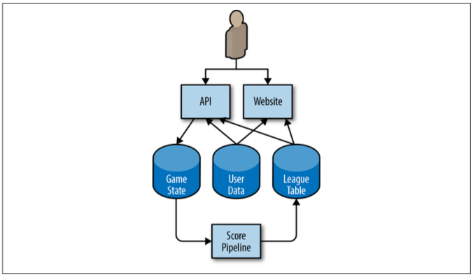
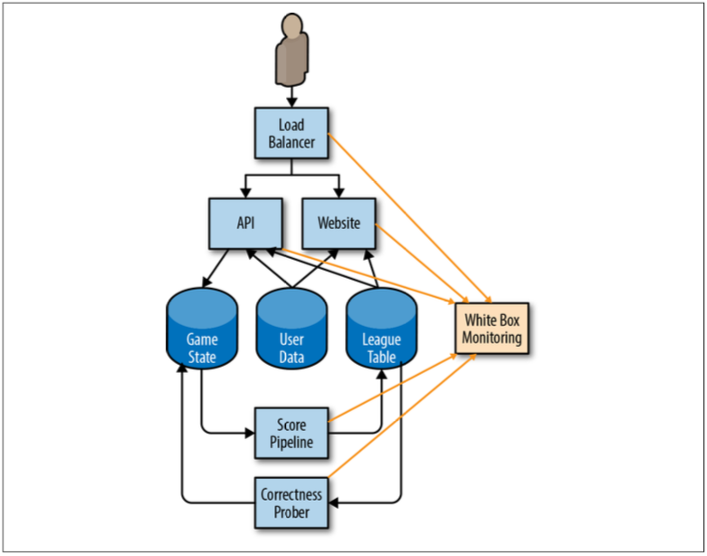

# 実例

図2-1に示すように、携帯電話ゲームの単純化されたアーキテクチャを考えてみましょう。

  
図2-1. 携帯電話ゲームのアーキテクチャ例

ユーザの携帯電話で実行されているアプリは、クラウド上で実行されているHTTPのAPIと対話します。
APIは状態の変更を永続的なストレージシステムに書き込みます。
このデータに対してパイプラインが定期的に実行され、今日、今週、総合でハイスコアを提供するリーグ表を生成します。
このデータは独立したリーグ表データストアに書き込まれ、結果はモバイルアプリ(ゲーム内スコア用)およびWebサイトから利用できます。
ユーザは、APIを介したゲーム内でもハイスコアWebサイトでも使用されるカスタムアバターをユーザデータテーブルにアップロードできます。

この設定であると仮定した場合、ユーザがシステムとどのようにやり取りするのか、そしてどのようなSLIがユーザエクスペリエンスのさまざまな側面を測定するのかを考えることができます。

これらのSLIの一部は重複することがあります。リクエスト駆動型サービスには正確性のSLIがあり、パイプラインには可用性のSLIがあり、耐久性のSLIは正確性のSLIの変形として見られることがあります。
顧客にとって最も重要な機能を表す少数(5つ以下)のSLIタイプを選択することをお勧めします。

典型的なユーザエクスペリエンスとロングテールの両方を把握するために、一部のタイプのSLIには複数段階のSLOを使用することも推奨します。
例えば、ユーザからのリクエストの90％が100ミリ秒以内に返却されるが、残りの10％が10秒かかる場合、多くのユーザは不幸になるでしょう。
レイテンシのSLOは、複数の閾値を設定することでこのユーザベースをとらえることができます。リクエストの90％は100ミリ秒より速く、リクエストの99％は400ミリ秒より速いといった具合です。
この原則は、ユーザの不幸を測定するパラメータを持つすべてのSLIに適用されます。

表2-1に、さまざまな種類のサービスに共通のSLIを示しています。

表2-1. さまざまな種類のコンポーネントに対する潜在的なSLI

| サービスタイプ | SLIタイプ | 説明 |
| --- | --- | --- |
| リクエスト駆動 | 可用性 | 応答が成功したリクエストの割合。 |
| リクエスト駆動 | レイテンシ | ある閾値よりも速いリクエストの割合。 |
| リクエスト駆動 | 品質 | 過負荷のときやバックエンドが利用できないときにサービスが適切に劣化した場合は、劣化していない状態で処理された応答の割合を測定する必要があります。例えば、ユーザデータストアが利用できない場合でも、ゲームはプレイ可能ですが一般的な画像が使用されます。 |
| パイプライン | 新鮮性 | ある閾値よりも最近に更新されたデータの割合。理想的には、このメトリクスはユーザエクスペリエンスを最も正確に反映するために、ユーザがデータにアクセスした回数をカウントします。 |
| パイプライン | 正確性 | パイプラインに入ってくる正しい値が出力されたレコードの割合。 |
| パイプライン | カバレッジ | バッチ処理の場合は、とある目標データ量を超えて処理したジョブの割合。ストリーミング処理の場合は、一定の時間枠内に正常に処理された受信レコードの割合。 |
| ストレージ | 耐久性 | 正常に読み取り可能な書き込まれたレコードの割合。耐久性SLIには特に注意してください。ユーザが望むデータは、格納されているデータのごく一部に過ぎないかも知れません。例えば、過去10年間に10億件のレコードがあり、ユーザが今日のレコードだけを入手したい場合(そして利用できない場合)、それらのデータのほとんどすべてが読み取り可能であっても不幸になります。 |

## SLI仕様からSLI実装への移行

SLI仕様を理解したならば、次にそれらを実装する方法について考え始める必要があります。

最初のSLIには、最小限のエンジニアリング作業を必要とするものを選択してください。
Webサーバのログはすでに利用可能であるが、調査の設定に数週間、JavaScriptの活用に数ヶ月かかる場合、ログを使用してください。

SLIを測定するには十分な情報が必要です。可用性には、成功/失敗ステータスが必要です。遅延リクエストの場合は、リクエストの処理時間が必要です。
この情報を記録するようにWebサーバを再設定する必要があるかもしれません。
クラウドベースのサービスを使用している場合は、この情報の一部がモニタリングダッシュボードで既に利用可できるようになっている可能性があります。

私たちのサンプルアーキテクチャのSLI実装にはさまざまなオプションがあり、各々、長所と短所があります。
次のセクションでは、私たちのシステムの3種類のコンポーネントのSLIについて詳しく説明します。

### APIとHTTPサーバの可用性とレイテンシ

考慮されたすべてのSLI実装では、応答の成功はHTTPステータスコードに基づいています。
5XX応答はSLOに対してカウントされますが、他のすべての要求は成功したと見なされます。
当社の可用性SLIは成功したリクエストの割合であり、当社のレイテンシSLIは定義された閾値より速いリクエストの割合です。

SLIは具体的で測定可能であるべきです。
20ページの『何を測定するか：SLIの使用』に記載されている潜在的な候補リストを要約すると、SLIは以下に記載する1つ以上のソースを使用できます。

* アプリケーションサーバログ
* ロードバランサモニタリング
* ブラックボックスモニタリング
* クライアントサイドツール

メトリクスが既に使用可能であり、アプリケーションサーバログから得られるSLIよりもユーザエクスペリエンスに近いSLIを提供するため、この例ではロードバランサモニタリングを使用します。

### パイプラインの新鮮性、カバレッジ、正確性

パイプラインがリーグテーブルを更新するとき、データが更新されたときのタイムスタンプを含む透かしを記録します。
いくつかSLIの実装例を記載します。

* リーグテーブルで定期的なクエリを実行し、新しいレコードの総数とレコードの総数を数えます。これは、何人のユーザがデータを見たかにかかわらず、古いレコードを等しく重要なものとして扱います。
* 新しいデータをリクエストしたときにリーグテーブルの全クライアントが透かしをチェックし、データがリクエストされたことを示すメトリックカウンタをインクリメントするようにします。データが事前に定義された閾値より新しい場合は、別のカウンターを増やします。

これら2つのオプションから、この例ではクライアントサイドでの実装を使用しています。これは、ユーザエクスペリエンスとより密接に関連し、追加が簡単なSLIを提供するためです。

カバレッジSLIを計算するために、私たちのパイプラインは処理すべきレコード数と処理に成功したレコード数をエクスポートします。
このメトリックでは、設定ミスが原因でパイプラインが認識しなかったレコードを見逃してしまうかも知れません。

正確性を測定するために可能なアプローチは2つあります。

* 既知の出力があるデータをシステムに投入し、その出力が期待と一致する時間の割合を数えます。
* パイプライン自体とは異なる入力に基づいて正しい出力を計算する方法を使用します(そしておそらく高価なのでパイプラインには適していない)。これを使用して入出力ペアをサンプリングし、正しい出力レコードの割合を数えます。この方法論では、そのようなシステムを構築することが可能かつ実用的であると仮定しています。

この例では、パイプラインが実行されるたびにテストされた既知の適切な出力と一緒に、ゲームの状態データベース内の手動でキュレーションされたデータに基づいて正確性SLIを決定します。
我々のSLIはテストデータにとって正確な登録の割合です。
このSLIが実際のユーザエクスペリエンスを表すためには、手動でキュレーションされたデータが現実世界のデータを表していることを確認する必要があります。

## SLIを測定する

図2-2では、ホワイトボックスモニタリングシステムがサンプルアプリケーションの様々なコンポーネントからメトリクスを収集する方法を示しています。

  
図2-2. モニタリングシステムでSLIメトリクスを収集する方法

我々のモニタリングシステムのメトリクスを使って初期段階のSLOを計算する例を見てみましょう。
この例では可用性とレイテンシのメトリクスを使用していますが、他のすべての潜在的なSLOにも同じ原則が適用されます。
我々のシステムが使用するメトリクスの完全なリストについては、[付録A](../../../23_appendix/examples-slo-document/README.md)を参照してください。
我々の例ではすべて[Prometheus記法](https://prometheus.io/)を使っています。

### ロードバランサメトリクス

バックエンド("api"または"web")とレスポンスコード別のリクエスト総数：

```Plain Text
    http_requests_total{host="api", status="500"}
```

累積ヒストグラムとしての合計レイテンシ。各バケットでは、その時間以下で処理されたリクエストの数をカウントします。

```Plain Text
    http_request_duration_seconds{host="api", le="0.1"}
    http_request_duration_seconds{host="api", le="0.2"}
    http_request_duration_seconds{host="api", le="0.4"}
```

一般的に言えば、ヒストグラムで近似値を求めるよりも遅いリクエストを数える方が良いです。
ただし、その情報は利用できないため、Googleではモニタリングシステムが提供するヒストグラムを使用しています。
別のアプローチとしては、ロードバランサ設定の様々遅延閾値に基づいて明示的な遅延リクエストのカウントをベースにすることもできるでしょう(例：100ミリ秒および500ミリ秒の閾値)。
この方策はより正確な数値を提供しますが、より多くの設定が必要になるため、閾値の変更を遡及的に困難にします。

```Plain Text
    http_request_duration_seconds{host="api", le="0.1"}
    http_request_duration_seconds{host="api", le="0.5"}
```

### SLIを計算する

前述のメトリクスを使用して、表2-2に示すように、過去7日間分までの現在のSLIを計算できます。

表2-2. 過去7日間のSLIの計算

|     |     |
| --- | --- |
| 可用性 | `sum(rate(http_requests_total{host="api",status!~"5.."}[7d])) / sum(rate(http_requests_total{host="api"}[7d])` |
| レイテンシ | `histogram_quantile(0.9, rate(http_request_duration_seconds_bucket[7d]))` `histogram_quantile(0.99, rate(http_request_duration_seconds_bucket[7d]))` |

## SLIを使用してはじめのSLOを計算する

はじめのSLOを取得するために、これらのSLIを管理可能な数(例えば、可用性の有効数字2桁、あるいはレイテンシ最大50ミリ秒)に切捨てることができます。

例えば、4週間に及ぶAPIメトリクスは次のようになります。

* リクエスト総数: 3,663,253
* 成功リクエスト総数: 3,557,865 (97.123%)
* 90パーセンタイルレイテンシ: 432 ミリ秒
* 99パーセンタイルレイテンシ: 891 ミリ秒

他のSLIについてもこのプロセスを繰り返し、表2-3に示すように、API用のSLO案を作成します。

表2-3. API用のSLO案

| SLOタイプ | 目標値                           |
| -------- | ------------------------------- |
| 可用性    | 97%                             |
| レイテンシ | リクエストの90%が450ミリ秒より小さい |
| レイテンシ | リクエストの99%が900ミリ秒より小さい |

[付録A](../../../23_appendix/examples-slo-document/README.md)ではSLO文書の完全例を提供します。
簡潔にするためにここでは省略しましたが、このドキュメントにはSLI実装も含まれます。

このSLI案に基づいて、表2-4に示すように、4週間にわたるエラー・バジェットを計算できます。

表2-4. 4週間分のエラー・バジェット

| SLO                             | 許容される不具合 |
| ------------------------------- | ------------- |
| 可用性97%                        | 109,897       |
| リクエストの90%が450ミリ秒より小さい | 366,325       |
| リクエストの99%が900ミリ秒より小さい | 36,632        |

----------
【5】ユーザがレイテンシについて50ミリ秒の変化を認知する可能性は低いですが、適切な時間帯は明らかにサービスとユーザーによって異なります。レポーティングサービスは、リアルタイムゲームとは異なります。
