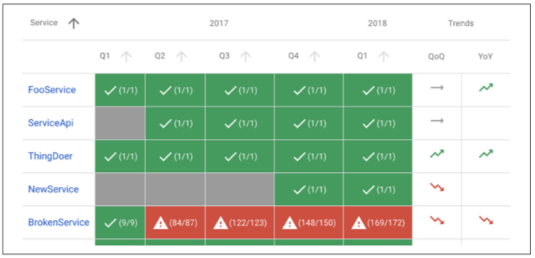
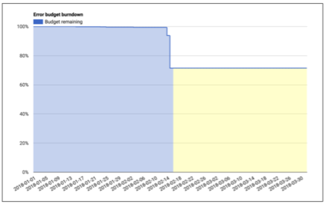

# ステークホルダーの合意を得る

SLO案が有用かつ効果的であるためには、すべてのステークホルダーに合意してもらう必要があります。

* プロダクト管理者は、この閾値がユーザにとって十分に良いということに合意しなければなりません。この値を下回るパフォーマンスは許容できないほど低く、修正にエンジニアリング時間を費やす価値があります。
* エラー・バジェットを使い果たした場合、プロダクト開発者は、サービスがバジェット内に戻るまで、ユーザへのリスクを軽減するための対策を講じることに合意しなければなりません(31ページの「エラー・バジェットポリシーの設定」を参照)。
* このSLOを守ることを任されている本番環境を担当するチームは、非常に骨の折れる努力、過度なトイル、そして極度の疲労なく防御可能であることに同意しました。これらはすべてチームとサービスの長期的な健康状態にダメージを与えます。

これらポイントがすべて合意されれば、難しい部分は完了です。【6】
あなたはSLOの旅を始めました、そして、残りのステップはこの出発点から繰り返しです。

SLOを守るためには、エラー・バジェットに対する脅威が赤字に変わる前にエンジニアがタイムリーに通知を受け取るようにモニタリングとアラート([第5章](../../05_alerting-on-slos/README.md)を参照)を設定する必要があります。

## エラー・バジェット方針の設定

SLOを取得したら、SLOを使用してエラー・バジェットを導出できます。
このエラー・バジェットを使用するには、サービス予算が不足したときの対処方法をまとめたポリシーが必要です。

すべての主要なステークホルダー(プロダクトマネージャ、開発チーム、およびSRE)にエラー・バジェットポリシーの承認を得ることによって、SLOが目的に適しているかどうか良くテストすることになります。

* SREが不当な量のトイルなくしてSLOを守ることはできないとSREが感じた場合、SREは目標を緩和する主張ができます。
* 開発チームとプロダクトマネージャが、信頼性を高めるためにリソースを増やすことで機能のリリース速度が許容レベルを下回ると感じている場合も、目標を緩和することを主張できます。SLOを引き下げると、SREが対応する局面の数も少なくなります。プロダクトマネージャはこのトレードオフを理解する必要があります。
* エラー・バジェットポリシーによって誰かしらにとって問題の解決を促されるより前に、SLOによってかなりのユーザに悪い経験をもたらすとプロダクトマネージャが感じた場合、SLOは十分厳重ではない可能性があります。

3者全員がエラー・バジェットポリシーを施行することに同意しない場合は、すべてのステークホルダが満足するまでSLIとSLOを繰り返す必要があります。
どのように前に進めるか、そして意思決定をするために何が必要かを決定します。より多くのデータやリソース、あるいはSLIまたはSLOへの変更です。

エラー・バジェットの施行について我々が話をするときは、エラー・バジェットを使い果たしたら(または使い果たしそうになったら)、システムの安定性を回復するために何をすべきかということを意味します。

エラー・バジェット施行の決定を下すには、文書化された方針から始める必要があります。このポリシーは、サービスがエラー・バジェットを一定期間ですべて消費したときに実行されなければならない特定のアクションに言及し、誰がそれらを実行するかを特定すべきです。
一般的なオーナーおよびアクションには次のものが含まれるでしょう。

* 開発チームは過去4週間にわたって信頼性の問題に関連するバグを最優先します。
* システムがSLO内に収まるまで、開発チームは信頼性の問題に専念します。この責任には、外部の機能リクエストや任務を先送りできるだけの高次承認が伴います。
* 更なる機能停止のリスクを減らすために、変更して再開するのに十分なエラー・バジェットが得られるまで、プロダクション凍結によってシステムへの特定の変更を停止します。

サービスがエラー・バジェットすべてを消費することがありますが、エラー・バジェットポリシーの制定が適切であることにすべてのステークホルダが同意するわけではありません。
このような場合は、エラー・バジェットポリシーの承認ステージに戻る必要があります。

## SLOとエラー・バジェットポリシーの文書化

適切に定義されたSLOは、他のチームやステークホルダがレビューできる主だった場所に文書化すべきです。
このドキュメントには次の情報が含まれています。

* SLOの作成者、レビュアー(技術的な正しさをチェックした人)、および承認者(それが正しいSLOかどうかについてビジネス上の意思決定をした人)
* 承認日付、および次にレビューすべき日付
* 読者に背景を把握させるためのサービスの簡単な説明
* SLOの詳細：目標とSLI実装
* エラー・バジェットの計算方法と消費方法の詳細
* 数字の裏にある論理的根拠、そしてそれらが実験データに由来するのか観察データに由来するのか。SLOが完全にアドホックであっても、この事実は文書化されるべきです。そうすれば、将来その文書を読むエンジニアがアドホックデータに基づいて良くない決定を下すことはありません。

SLO文書をどのくらいの頻度でレビューするかは、SLO文化の成熟度によって異なります。
最初はSLOを頻繁に(おそらく毎月)見直すべきでしょう。
一度SLOの妥当性がより確立されれば、おそらくレビュー実施を四半期ごと、またはそれより少ない頻度に減らすことができます。

エラー・バジェットポリシーも文書化する必要があり、次の情報を含める必要があります。

* ポリシー作成者、レビュアー、承認者
* 承認日付、および次にレビューすべき日付
* 読者に背景を把握させるためのサービスの簡単な説明
* バジェット枯渇に対応してとられるべき行動
* 計算に不一致がある場合、または合意された行動が状況に適しているかどうかをフォローするための明確なエスカレーションパス
* 聞き手のエラー・バジェット経験と専門知識のレベルによっては、エラー・バジェットの概要を含めることが有益な場合があります。

SLO文書とエラー・バジェットポリシーの例については、[付録A](../../../23_appendix/examples-slo-document/README.md)を参照してください。

## ダッシュボードとレポート

公開されているSLOおよびエラー・バジェットポリシー文書に加えて、他のチームとのコミュニケーションや問題エリアの見当をつけるために、サービスのSLO遵守に関する即時スナップショットを提供するレポートとダッシュボードを用意すると便利です。

図2-3のレポートは、いくつかのサービスの全体的な遵守度合いを示しています。
前年度の四半期SLOがすべて満たされているかどうか(括弧内の数字は、達成された目標数と総目標数を示してます)、また、SLIが前四半期と昨年の同一四半期と比較して上方傾向または下方傾向にあるかを示しています。

  
図2-3. SLO遵守レポート

SLIの傾向を示すダッシュボードを用意するのも便利です。
これらのダッシュボードは、通常よりも高いレートでバジェットを消費しているかどうか、または注意が必要なパターンや傾向があるかどうかを示します。

図2-4のダッシュボードは、その四半期の途中の1つの四半期のエラー・バジェットを示しています。
ここでは、1つのイベントで2日間に渡ってエラー・バジェットの約15％が消費されたことが分かります。

  
図2-4. エラー・バジェットダッシュボード

エラー・バジェットは、これらのイベントを定量化するのに役立ちます。
例えば、「この停止により四半期のエラー・バジェットの30％が消費されました」、あるいは、「これらは今四半期の上位3インシデントで、エラー・バジェットの消費量順に表示されています」などです。

サービス停止やチケットの急増がSLIやSLOで捉えられない場合、またはユーザが直面している問題に関連しないSLI低下やSLOの失敗がある場合、これはSLOがカバレッジを欠いていることを示す強い兆候です。
この状況は完全に正常であり、期待されるべきものです。
SLIとSLOは、それらが表すサービスに関する現実が変化するにつれて、時間の経過とともに変化するはずです。
時間をかけてそれらを調べ、改良することを恐れないでください。

SLOがカバレッジを欠いている場合、取ることができる行動指針がいくつかあります。

_SLOを変更する_  
SLIが問題を示したが、SLOによって誰かが気付いたり反応したりするよう促されなかった場合、あなたはSLOを厳しくする必要があるかもしれません。

* その日のインシデントが対処する必要があるほど大きかった場合は、対象期間中のSLI値を調べます。SLOによってそれらの日付に通知が出された結果を計算します。そのSLOを過去のSLIに適用し、この調整によって他にどのようなイベントが発生したのかを確認します。チームが重要でないイベントに常に対応しなければならないように精度を下げた場合、システムの再現率を改善しても無意味です。【7】
* 同様に、誤検知の日にはSLOを緩和させることを検討してください。

SLOをどちらかの方向に変更しても、誤検知または検知漏れが多すぎる場合は、SLI実装も改善する必要があります。

_SLI実装を変更する_  
SLI実装を変更するには2つの方法があります。
測定の質を向上させるためにメトリックをユーザの近くに移動させる方法と、より高い割合のユーザ操作をキャプチャするためにカバレッジを向上させる方法です。
以下に例を記載します。

* サーバで成功/レイテンシを測定するのではなく、ロードバランサまたはクライアントで測定します。
* 単純なHTTP GETリクエストで可用性を測定する代わりに、システムのより多くの機能を実行するヘルスチェックハンドラ、あるいはすべてのクライアントサイドJavaScriptを実行するテストを利用します。

_意欲的なSLOを制定する_  
ユーザーを満足させるためにはより厳密なSLOが必要だと判断することもありますが、そのSLOを満たすようにプロダクトを改良するにはしばらく時間がかかります。
より厳密なSLOを実装すると、あなたは永久的にSLOから抜け出し、エラー・バジェットポリシーに従うことになります。
この状況では、洗練されたSLOを意欲的なSLOにすることができます。意欲的なSLOは現在のSLOと並行して測定および追跡されますが、アクションを必要としないものとして明示的にエラー・バジェットポリシーで要求されます。
このようにして、意欲的なSLOを満たすための進捗状況を追跡することができますが、あなたは絶えず緊急事態にいることを望まないでしょう。

_イテレート_  
イテレートには様々な方法があり、レビューセッションでは改善の可能性が沢山あります。
最も高い投資収益率が得られる可能性が最も高いオプションを選択します。
特に最初の数回のイテレートでは、より速くより安くする面で間違いを犯します。
そうすることで、メトリックの不確実性が軽減され、より高価なメトリックが必要かどうかを判断するのに役立ちます。
必要に応じて何度でも繰り返します。

----------
【6】免責事項：将来、もっと難しいタスクがあるかもしれません。

【7】再現率は、SLIが取得したユーザに重大な影響を与えるイベントの割合です。精度とは、ユーザに大きな影響を与えたSLIによってキャプチャされたイベントの割合です。
