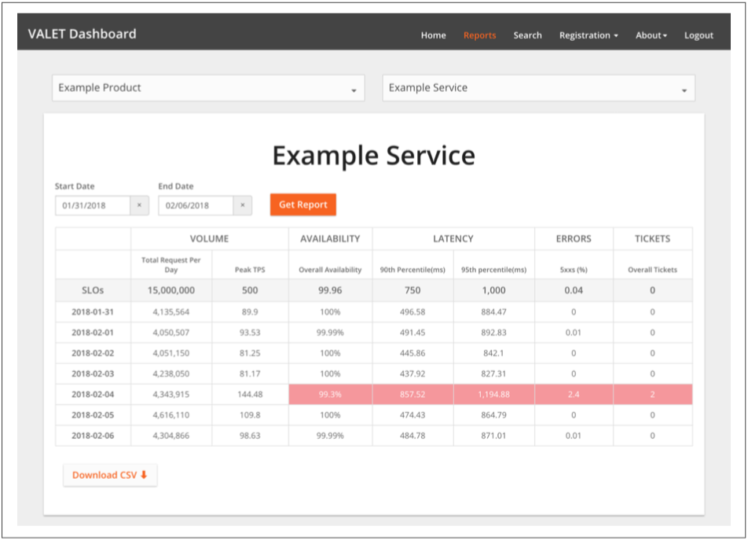

# Home DepotのSLOストーリー

by William Bonnell, The Home Depot

ホームデポ(THD)は、世界最大のホームセンターの小売業者です。北米各地に2,200以上の店舗があり、それぞれ35,000以上のユニークな商品で構成されています(そしてオンラインで150万以上の商品が供給されています)。
当社のインフラストラクチャは、400,000人近くの従業員をサポートし、年間15億以上の顧客取引を処理するさまざまなソフトウェアアプリケーションをホストしています。
これらの店舗は、世界規模のサプライチェーンおよび年間20億回以上の訪問を受けるeコマースWebサイトと緊密に統合されています。

ソフトウェア開発のスピードと品質を高めることを目的とした最近のオペレーションアプローチの更新により、THDはアジャイルソフトウェア開発に焦点を合わせ、ソフトウェアの設計と管理方法を変更しました。
私たちは、大規模なモノリシックソフトウェアパッケージをサポートする中央集権型のサポートチームから、小規模で独立して運営されるソフトウェア開発チームによるマイクロサービスアーキテクチャへと移行しました。
その結果、私たちのシステムには常に、絶えず変化するソフトウェアの小さな塊があり、それらもスタック全体に統合する必要がありました。

マイクロサービスへの移行は、フルスタックオーナーシップの新しい「自由と責任の文化」への移行によって補完されました。
このアプローチにより、開発者は必要なときに自由にコードをプッシュすることができますが、同時にサービスの運用に対して共同で責任を負うことになります。
この共有オーナーシップモデルが機能するためには、運用チームと開発チームが、説明責任を促進し、複雑さを乗り越えるための共通言語、つまりサービスレベル目標を話す必要があります。
互いに依存しているサービスは、次のような情報を知る必要があります。

* あなたのサービスはどの程度信頼できますか？それは、3ナイン、3.5ナイン、または4ナイン(またはそれ以上)を目標に構築されていますか？計画的な停止時間はありますか？
* 上限に達すると、どのようなレイテンシが予想されますか？
* これから送ろうとしている大量のリクエストを処理できますか。どのように過負荷状態を処理しますか？サービスは時間の経過とともにSLOを達成しましたか？

すべてのサービスがこれらの質問に対する透過的で一貫した回答を提供できる場合、チームは依存関係を明確に把握できるため、チーム間のコミュニケーションが向上し、信頼性と説明責任が向上します。

## SLO文化プロジェクト

このサービスモデルの移行を始める前は、ホームデポにはSLOの文化はありませんでした。
監視ツールやダッシュボードは豊富でしたが、あちこちに散らばっていて、時間の経過とともにデータを追跡することはできませんでした。
特定の機能停止の根本にあるサービスを特定できるとは限りませんでした。
多くの場合、私たちはユーザに面しているサービスからトラブルシューティングを始め、問題が見つかるまでバックエンド方向に作業し、無数の時間を無駄にしました。
サービスに計画的な停止時間が必要な場合、その依存サービスは驚くべきものでした。
チームが3.5ナインのサービスを構築する必要がある場合、依存しているサービスがより優れた稼働時間(4ナイン)でそれらをサポートできるかどうかはわかりません。
これらの断絶は、当社のソフトウェア開発チームと運用チームの間で混乱と失望を引き起こしました。

私たちはSLOの共通文化を築くことによってこれらの断絶に対処する必要がありました。
そのためには、人、プロセス、およびテクノロジに影響を及ぼすための包括的な戦略が必要でした。
4つの一般的な分野について我々は努力しました。

_共通的な専門用語_  
THDのコンテキストでSLOを定義します。それらを一貫した方法で測定する方法を定義します。

_エヴァンジェリズム_  
用語を全社に広めてください。

* SLOが重要な理由、社内でのロードショー、社内ブログ、Tシャツやステッカーなどの宣伝材料を販売するためのトレーニング資料を作成します。
* SLOを実装し、他者への価値を実証するために、何人か早期導入者を参加させます。
* アイデアを広めるために、わかりやすい略語(VALET:後述)を設定します。
* SLOやその他信頼性の概念について開発者をトレーニングするための訓練プログラム(FiRE Academy:信頼性エンジニアリングの基礎)を作成します。【2】

_自動化_  
導入の煩わしさを軽減するために、本番環境にデプロイされたサービスのサービスレベル指標を自動的に収集するメトリック収集プラットフォームを実装します。これらのSLIは後でより簡単にSLOに変えることができます。

_インセンティブ_  
すべての開発管理者が自分たちのサービスのSLOを設定し、測定するための年間目標を立てます。

共通の用語を確立することは、全員を同じページに参加させるために必要不可欠でした。
私たちはまた、このフレームワークをできるだけシンプルにして、アイデアをより早く広めることを目指しました。
はじめに、さまざまなサービスにわたって監視している指標を批判的に調べたところ、いくつかのパターンを見つけました。
すべてのサービスは、何らかの形でトラフィック量、レイテンシ、エラー、利用率を監視していました。これは、Google SREの[Four Golden Signals](http://bit.ly/2LSLpDQ)と密接に関連しています。
さらに、多くのサービスでは、稼働時間や可用性をエラーとは区別して監視していました。
残念ながら、全体的に見て、すべてのカテゴリのメトリクスが一貫性のない方法で監視されているか、名前が異なるか、データが不十分でした。

私たちのサービスのどれもSLOを持っていませんでした。
私たちの本番システムが顧客向けのSLOに最も近いメトリックはサポートチケットでした。
店舗にデプロイされているアプリケーションの信頼性を測定するための主な(そして大抵は唯一の)方法は、社内のサポートデスクが受けたサポートコールの数を追跡することでした。

## 最初のSLO

測定可能なシステムのあらゆる側面に対してSLOを作成することはできませんでした。そのため、どのメトリクスまたはSLIにもSLOを含めるべきかを決定する必要がありました。

### APIコールの可用性とレイテンシ

各マイクロサービスは、他のマイクロサービスからのAPIコールに対して可用性とレイテンシのSLOを持つ必要があると判断しました。
たとえば、カートマイクロサービスは在庫マイクロサービスに呼ばれていました。
これらのAPIコールについて、カートマイクロサービス(および在庫を必要とするその他のマイクロサービス)が、在庫マイクロサービスが自身の信頼性要件を満たすことができるかどうかを判断するためのSLOを在庫マイクロサービスが公開しました。

### インフラ使用率

THDのチームは様々な方法でインフラストラクチャ使用率を測定しますが、最も一般的な測定は1分単位でのリアルタイムインフラストラクチャ使用率です。
いくつかの理由で、使用率SLOの設定に反対しました。
はじめに、マイクロサービスはこの測定基準に過度には関心を寄せていません。トラフィック量を処理できている、マイクロサービスが起動している、即時にレスポンスしている、エラーを投げていない、キャパシティ不足の危険にさらされていない限り、ユーザは使用率を気にする必要はありません。
さらに、近い将来のクラウド移行により、利用率はそれほど問題にならなくなるため、コスト計画によってキャパシティ計画が覆い隠されることになります。(使用率を監視してキャパシティプランニングを実行する必要がありますが、それをSLOフレームワークに含める必要はありませんでした。)

### トラフィック量

THDにはキャパシティプランニングの文化がまだなかったので、私たちは彼らのサービスが処理できる量を伝えるためのソフトウェアと運用チーム向けのメカニズムが必要でした。
トラフィックは、サービスへのリクエストであるとして定義するのは簡単でしたが、1秒あたりの平均リクエスト数、1秒あたりのピークリクエスト数、またはレポート期間中のリクエスト量を追跡するかどうかを決定する必要がありました。
3つすべてを追跡し、各サービスに最も適切なメトリックを選択することにしました。
このメトリックは、制御可能な内部要因ではなくユーザの行動によって決定されるため、トラフィック量にSLOを設定するかどうかを検討しました。
最終的に、小売業者としてブラックフライデーのようなピークに合わせてサービスをサイジングする必要があると判断したため、予想されるピークキャパシティに従ってSLOを設定しました。

### レイテンシ

各サービスにレイテンシのSLOを定義させ、どこで測定するのが最適かを決定します。
私たちの唯一の要求は、ネットワークやキャッシュやプロキシのようなマイクロサービスの外側で失敗する他のレイヤによって引き起こされる問題を捉えるために、サービスがブラックボックス監視で一般的なホワイトボックスパフォーマンス監視を補うべきであるということでした。
また、パーセンタイルは算術平均よりも適切であると判断しました。
少なくとも、サービスは90パーセンタイルの目標を達成する必要がありました。ユーザ向けサービスでは、95パーセンタイルまたは99パーセンタイル、あるいはその両方を優先的な目標としていました。

### エラー

エラーを説明するのはやや複雑でした。
私たちは主にWebサービスを扱っていたので、エラーを構成する要素とエラーを返す方法を標準化する必要がありました。
Webサービスにエラーが発生した場合は、当然ながらHTTPレスポンスコードで標準化されています。

* サービスは、2xx応答の本文にエラーを示すべきではありません。むしろ、それは4xxか5xxを投げるべきです。
* サービスの問題(例えばメモリ不足)が原因で発生したエラーは、5xxエラーをスローすべきです。
* クライアントによって引き起こされたエラー(例えば、不正なリクエスト送信)は、4xxエラーをスローすべきです。

十分に検討した結果、4xxと5xxの両方のエラーを追跡することにしましたが、5xxエラーはSLOを設定するためだけに使用しました。
他のSLO関連要素に対する私たちのアプローチと同様に、私たちはこのディメンションを一般的なものにして、異なるアプリケーションが異なるコンテキストにそれを利用できるようにしました。
例えば、HTTPエラーに加えて、バッチ処理サービスのエラーは、処理に失敗したレコード数になるでしょう。

### チケット

前述したように、チケットは元々私たちのプロダクションソフトウェアの大部分を評価する主な方法でした。
歴史的な理由から、私たちは他のSLOと一緒にチケットを追跡し続けることにしました。
このメトリックは、「ソフトウェア運用レベル」のようなものと同類と考えることができます。

### VALET

私達は新しいSLOを便利な略語にまとめました：VALETです。

_Volume(traffic)_  
サービスはどのくらいのビジネス量を扱うことができますか？

_Availability_  
必要なときにサービスは起動していますか？

_Latency_  
使用したときにサービスが高速に応答しますか？

_Errors_  
サービスを使用するとエラーが発生しますか？

_Tickets_  
サービスは私の要求を完了するために手作業の介入が必要ですか？

## SLOを伝道する

覚えやすい略語で武装して、私たちは企業にSLOを伝道することに着手しました。

* なぜSLOが重要なのか
* SLOが私たちの「自由と責任」文化をどのように支えているか
* 何を計測すべきか
* 結果に対して何をするか

開発者がソフトウェア運用を担当するようになったため、信頼性の高いソフトウェアを構築およびサポートする能力を実証し、顧客向けサービスについてサービス消費者およびプロダクトマネージャとコミュニケーションを取るためのSLOを確立する必要がありました。
しかし、オーディエンスの大半はSLAやSLOのような概念に精通していなかったので、彼らはこの新しいVALETフレームワークについて教育を受ける必要がありました。

SLOへの移行のためにエグゼクティブの後押しを勝ち取る必要があったため、私たちの教育キャンペーンは上級管理職から始まりました。
その後、開発チームと1人ずつ会ってSLOの価値を高めました。
私たちは、チームが彼らのカスタムメトリクス追跡メカニズム(大抵は手動)からVALETフレームワークへ移行することを推奨しました。
その勢いを継続させるために、私たちは週に1回のSLOレポートをVALETフォーマットで送りました。また、一般的な信頼性の概念と社内イベントから学んだ教訓についての上級管理者向けの解説を組み合わせました。
これは、作成された購買発注(量)や処理に失敗した購買発注(エラー)などのビジネス指標をVALETの観点から評価するのにも役立ちました。

私達はさらに伝道を色々な方法で拡大しました。

* VALETと信頼性に関するブログをホストするため、内部のWordPressサイトを開設し、有用なリソースをリンクしました。
* 一般的な信頼性の概念とVALETによる測定方法を議論するために、社内のテクニカルトーク(Google SREゲストスピーカー含む)を行いました。
* 私達は一連のVALETトレーニングワークショップ(後にFiREアカデミーに発展)を実施して、参加希望者全員を招待しました。これらのワークショップへの参加は数ヶ月間堅調でした。
* 総合的な社内マーケティングキャンペーンをサポートするために、VALETラップトップステッカーやTシャツも作成しました。

すぐに会社の誰もがVALETを知っていて、SLOの私たちの新しい文化が定着し始めました。
SLOの導入でさえ、開発マネージャのためのTHDの年次パフォーマンスレビューに公式に織り込むようになりました。
毎週約50のサービスがSLOを定期的に把握して報告していましたが、メトリクスをアドホックにスプレッドシートに保存していました。
VALETのアイデアは山火事のように捉えられていましたが、私たちは広範囲の採用を促進するためにデータ収集を自動化する必要がありました。

## VALETデータ収集の自動化

私たちのSLOの文化は今では強い足場を持っていますが、VALETデータ収集の自動化はSLOの採用を加速するでしょう。

### TPSレポート

新GCP環境に展開されたサービスのVALETデータを自動的に取得するためのフレームワークを構築しました。
このフレームワークをTPSレポートと呼んでいます。これは、量とパフォーマンス(1秒あたりのトランザクション数)のテストで使用した用語であり、もちろん複数の管理者がこのデータを確認したいという考えを[からかっています](http://bit.ly/2J4bGkL)。
GCPのBigQueryデータベースプラットフォームの上にTPSレポートフレームワークを構築しました。
Webサービスを提供するフロントエンドによって生成されたすべてのログは、TPSレポートによる処理のためにBigQueryに送り込まれました。
Stackdriverによる可用性の検証など、他のさまざまな監視システムのメトリクスも含めました。

TPSレポートはこのデータを、誰でも照会できる1時間ごとのVALETメトリクスに変換しました。
新しく作成されたサービスは自動的にTPSレポートに登録されるため、すぐに照会できます。
データはすべてBigQueryに格納されているので、時間枠を超えてVALETメトリクスについて効率的にレポートできます。
このデータを使用して、さまざまな自動レポートとアラートを作成しました。
最も興味深いインテグレーションは、私たちが商用チャットプラットフォームにてVALETサービスの価値について直接報告できるようにするチャットボットでした。
例えば、過去1時間のVALET、先週と比較したVALET、SLO外のサービス、およびチャットチャネル内でのその他のさまざまな興味深いデータを表示するサービスがあります。

### VALETサービス

次のステップは、SLOデータを保存して報告するためのVALETアプリケーションを作成することです。
SLOはトレンド分析ツールとして最も活用されているので、サービスはSLOを毎日、毎週、および毎月の粒度で追跡します。
SLOは、エラー・バジェットに使用できるトレンド分析ツールですが、監視システムに直接接続されているわけではありません。
その代わりに、さまざまな種類のモニタリングプラットフォームがあり、それぞれ独自のアラートがあります。
これらの監視システムは、SLOを日次のベースとして集計し、トレンド分析のためにVALETサービスに公開します。
この設定の欠点は、監視システムで設定されたアラートしきい値がSLOと統合されていないことです。けれども、必要に応じて監視システムを変更する柔軟性はあります。

GCPで実行されていない他のアプリケーションとVALETを統合する必要性を見越して、サービスのVALETデータを毎日収集するためのAPIを提供するVALET統合層を作成しました。
TPSレポートは、VALETサービスと統合した最初のシステムであり、最終的にはさまざまなオンプレミスのアプリケーションプラットフォーム(VALETに登録されているサービスの半分以上)と統合されました。

### VALETダッシュボード

VALETダッシュボード(図3-1参照)は、このデータを視覚化してレポートするためのUIであり、比較的単純です。
ユーザは以下のことをすることができます。

* 新しいサービスを登録します。これは通常、すでにVALETデータが収集されている可能性がある1つ以上のURLにサービスを割り当てることを意味します。
* 5つのVALETカテゴリのいずれかに対してSLO目標を設定します。
* 各VALETカテゴリの下に新しいメトリックタイプを追加します。例えば、あるサービスは99パーセンタイルでレイテンシを追跡するが、別のサービスが90パーセンタイル(またはその両方)でレイテンシを追跡する場合があります。あるいは、バックエンド処理システムが日次レベルで処理量(1日に作成された購買発注)を追跡するのに対し、顧客対応nおフロントエンドは1秒あたりのピークトランザクションを追跡するかも知れません。

VALETダッシュボードを使用すると、ユーザは一度に沢山のサービスのSLOについてレポートしたり、さまざまな方法でデータをスライスしたりさいの目切りしたりすることができます。
例えば、チームは、過去1週間にSLOを守れなかったすべてのサービスの統計を表示できます。
サービスパフォーマンスを見直そうとしているチームは、すべてのサービスとそれらが依存しているサービス全体のレイテンシを確認できます。
VALETダッシュボードは単純なCloud SQLデータベースにデータを保存し、開発者は人気のある商用レポート作成ツールを使用してレポートを作成します。

これらのレポートは、開発者にとって新しいベストプラクティスの基盤となりました。サービスの定期的なSLOレビューです(通常は毎週または毎月)。
これらのレビューに基づいて、開発者はサービスをSLOに戻すためのアクション項目を作成するか、または非現実的なSLOを調整する必要があると判断することができます。

  
図3-1. VALETダッシュボード

## SLOの拡散

SLOが組織の総合的な考え方にしっかりと固まり、効果的な自動化とレポーティングが行われると、新しいSLOが急速に拡散しました。
年初に約50のサービスのSLOを追跡した後、年末までに800のサービスのSLOを追跡し、毎月約50の新しいサービスがVALETに登録されました。

VALETにより、THD全体でSLOの採用を拡大することができたため、自動化を開発するのに必要な時間的な努力は、それだけの価値がありました。
ただし、他の企業が同程度の複雑な自動化を開発できなくても、SLOベースのアプローチを採用することを恐れてはいけません。
自動化はTHDに追加の利益をもたらしましたが、そもそもSLOを書くことに利点があります。

## バッチアプリケーションへのVALET適用

SLOを中心とした安定したレポートを作成したところ、VALETのその他の用途がいくつか見つかりました。
少し調整するだけで、バッチアプリケーションは次のようにこのフレームワークに適用することができます。

_Volume_  
処理レコード量

_Availability_  
特定の時間までにどの程度(パーセンテージ)のジョブが完了しているか

_Latency_  
ジョブ実行までにかかる時間

_Errors_  
処理に失敗したレコード

_Tickets_  
オペレータが手動でデータ修正やジョブの再処理を実施した回数

## テストにVALETを使用する

同時にSRE文化を発展させていたので、VALETがステージング環境での破壊的テスト(カオスエンジニアリング)の自動化をサポートしていることがわかりました。
TPSレポートのフレームワークが整っていれば、破壊的テストを自動的に実行して、サービスのVALETデータにその影響(またはおそらく影響がないこと)を記録することができます。

## 今後の抱負

VALETデータを収集する800のサービス(今も増加している)によって、私たちは沢山の自由で便利な運用データを保持しています。
私たちは未来への願望がいくつかあります。

SLOを効果的に収集しているので、このデータを使用して行動を起こそうとしています。
次のステップは、Googleに似たエラー・バジェット文化です。サービスがSLOの範囲外になった場合、チームは(信頼性向上以外の)新機能の追加をやめます。
ビジネスのスピード要求を守るためには、SLOの報告期間(毎週または毎月)とSLO違反の頻度との間で適切なバランスを見つけるよう努力する必要があります。
多くの企業がエラー・バジェットを採用しているように、ローリングウィンドウと固定ウィンドウの長所と短所を比較検討しています。

詳細なエンドポイントとサービスの利用者を追跡するために、VALETをさらに改良したいと思います。
現在、特定のサービスに複数のエンドポイントがある場合でも、サービス全体のみVALETを追跡します。
その結果、異なる操作を区別することが困難になります(例えば、カタログへの書き込みとカタログへの読み取りです。これらの操作を別々に監視、検知しますが、SLOを追跡することはできません)。
同様に、サービスの利用者ごとにVALETの結果を区別したいと思います。

現在はWebサービングレイヤでレイテンシSLOを追跡していますが、エンドユーザのレイテンシSLOも追跡したいと思います。
この測定によって、サードパーティのタグ、インターネットレイテンシ、CDNキャッシュなどの要素が、ページのレンダリング開始およびレンダリング完了までの所要時間に与える影響を把握します。

VALETデータをアプリケーションデプロイへ拡大したいと思います。
具体的には、次のサーバ、ゾーン、または地域に変更を適用する前に、自動化を使用してVALETが許容範囲内であることを確認します。

サービスの依存関係に関する情報収集を開始し、コールツリーに沿ってVALETメトリクスに到達していない場所を示す視覚的なグラフを試作しました。
この種の分析は、新しいサービスメッシュプラットフォームによってさらに簡単になります。

最後に、サービスのSLOは、サービスのビジネス・オーナー(大抵プロダクトマネージャーと呼ばれます)がビジネスに対する重要度に基づいて設定する必要があると強く考えています。
少なくとも、ビジネス・オーナーには、サービスの稼働時間に関する要件を設定し、そのSLOをプロダクト管理と開発の共有目標として使用してもらいたいと考えています。
技術者はVALETを直感的に理解していましたが、プロダクトマネージャにとって、そのコンセプトはそれほど直感的ではありませんでした。
私たちは、VALETに関連する用語を使用して、VALETの概念を単純化しようと努力しています。稼働時間の選択肢を単純化するとともに、メトリックの例を示しました。
また、あるレベルから別のレベルに移行するためには多額の投資が必要であることも強調しています。
ここでは、提供できる簡単なVALETメトリックの例を示します。

* 99.5％：店員や新サービスのMVPで使用されていないアプリケーション
* 99.9％：THDの非販売システムの大部分に適している
* 99.95％：販売システム(または販売システムを支援するサービス)
* 99.99％：共同インフラサービス

ビジネスの観点からメトリクスを設定し、プロダクトと開発の間で目に見える目標(SLOです!)を共有することで、大企業でよく見られる、信頼性に対する多くの誤った期待を減らすことができます。

----------
【2】トレーニングオプションは、1時間の入門講座や半日のワークショップ、完了したら卒業式とFiREバッジが付与される熟練SREチームとのハードな4週間の集中訓練まであります。

【3】1999年の映画[オフィススペース](http://www.imdb.com/title/tt0151804/)で有名になりました。
