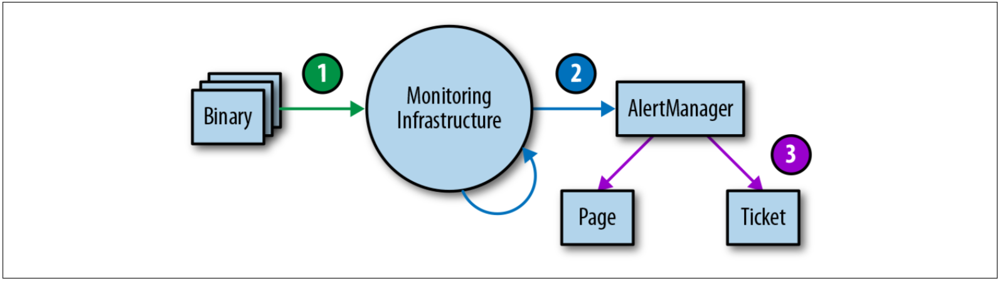

# アラートロジックをテストする

理想的な世界では、コードの監視とアラートは、コード開発と同じテスト標準に従うべきです。
Prometheusの開発者は[モニタリングのための単体テスト開発](http://bit.ly/2JcobXe)について議論していますが、現在、これを可能にする広く採用されたシステムはありません。

Googleでは、ドメイン固有の言語を使用して監視とアラートをテストし、総合的な時系列を作成できるようにしています。
次に、導出された時系列の値、または特定のアラートの起動ステータスとラベルの存在に基づいてアサーションを作成します。

監視とアラートは、多くの場合、複数の単体テスト群を必要とする多段プロセスです。
この分野はまだ十分に開発されていませんが、ある時点で監視テストを実装する場合は、図4-1に示すように3段階のアプローチを推奨します。

  
図4-1. テスト環境の監視層

1. **バイナリレポーティング**: エクスポートされたメトリック変数の値が、特定の条件下で予想どおりに変化することを確認します。
1. **監視設定**: ルール評価が期待される結果を生成し、特定の条件において期待したアラートが生成されることを確認してください。
1. **アラート設定**: 生成されたアラートが、アラート・ラベル値に基づいて事前に定義された宛先にルーティングされることをテストします。

総合的な手段で監視をテストできない場合、または単にテストできない監視ステージがある場合は、リクエストやエラーの数などの既知のメトリクスをエクスポートする実行システムの作成を検討してください。
このシステムを使用して、導出された時系列およびアラートを検証できます。
アラートのルールを構成してから数か月または数年経過してもアラートが発砲されない可能性が非常に高く、メトリックが特定のしきい値を超えると、適切なエンジニアに意味のある通知が送信されるという確信が必要です。
