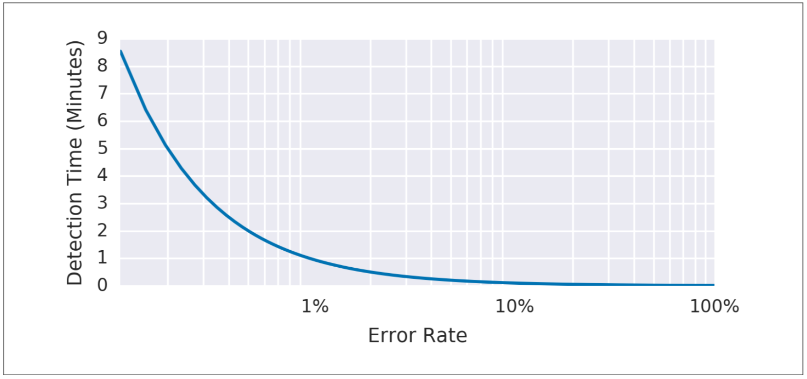

# 重要なイベントのアラート方法

SLOのアラートルール構成は、非常に複雑になる場合があります。
ここでは、精度、リコール、検知時間およびリセット時間の4つのパラメータを同時にうまく制御するオプションに到達するために、忠実度順で重要なイベントに関するアラートを設定する6つの方法を提示しました。
次のアプローチはそれぞれ異なる問題に対処し、いくつかは最終的に複数の問題を同時に解決します。
最初の3つの実現性のない試みは、最後の3つの実現可能なアラート戦略に向けて機能します。6つのアプローチは最も実現可能で最も推奨されるオプションです。
最初の方法は、実装は簡単ですが不十分です。一方、最適な方法は、長期的にも短期的にもSLOを守るための完全なソリューションを提供します。

この説明の目的上、「エラー・バジェット」と「エラー率」はすべてのSLIに適用されます。ただ名前に「エラー」が含まれるものだけではありません。
[20ページの「何を測定するか：SLIの使用」セクション](../../02_implementing-slos/02_02_getting-started/README.md#何を測定するか：SLIの使用)では、イベント合計に対する正常イベントの比率を収集するSLIの使用をお勧めしています。
エラー・バジェットは、許容される異常イベントの数を示し、エラー率は、合計イベントに対する異常イベントの比率です。

## 1:対象のエラー率 ≥ SLO閾値

最も簡単な解決策としては、小さな時間枠(例えば10分)を選択し、その時間枠でのエラー率がSLOを超えた場合にアラートを出すことができます。

例えば、SLOが30日間で99.9%の場合、過去10分間のエラー率が0.1%以上になったときに警告します。

    - alert: HighErrorRate
      expr: job:slo_errors_per_request:ratio_rate10m{job="myjob"} >= 0.001

この10分平均は、記録ルールを使用してPrometheusで計算されます。

    record: job:slo_errors_per_request:ratio_rate10m
    expr:
        sum(rate(slo_errors[10m])) by (job)
        　/
        sum(rate(slo_requests[10m])) by (job)

slo_errorsとslo_requestsをジョブからエクスポートしない場合、メトリックの名前を変更して時系列を作成できます。

    record: slo_errors
    expr: http_errors

最新のエラー率がSLOと等しいときにアラートすることは、システムが次のバジェットの使用を検出したことを意味します。

    アラートウィンドウサイズ/レポート期間

図5-1は、10分のアラートウィンドウと99.9%のSLOを持つサービス例の検知時間とエラー率の関係を示しています。

  
図5-1. アラートウィンドウが10分でSLOが99.9%のサービス例の検知時間
