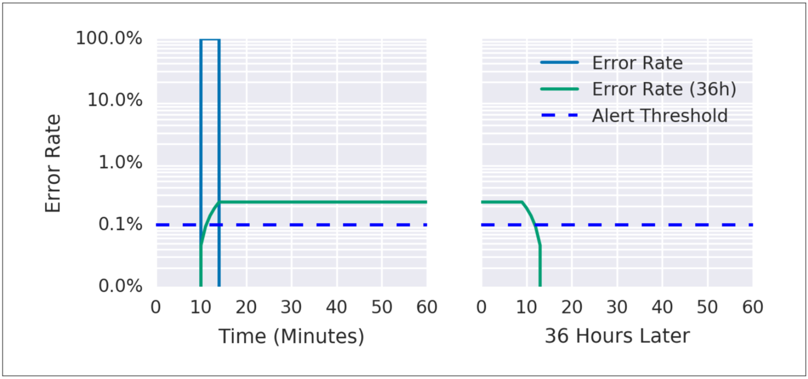
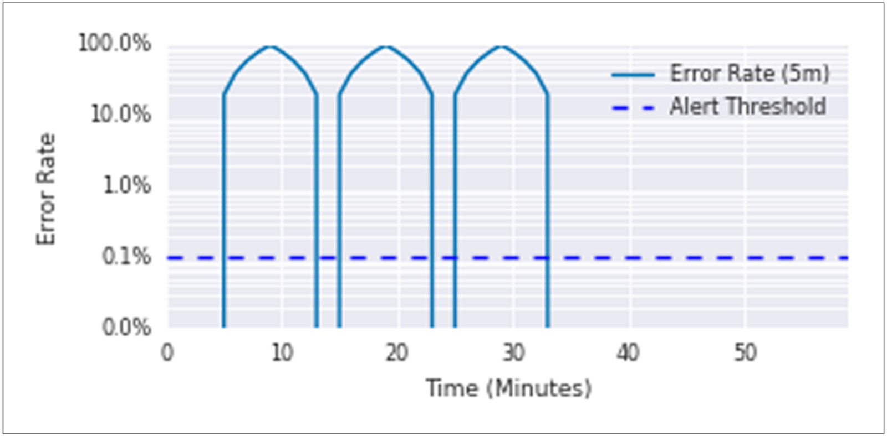
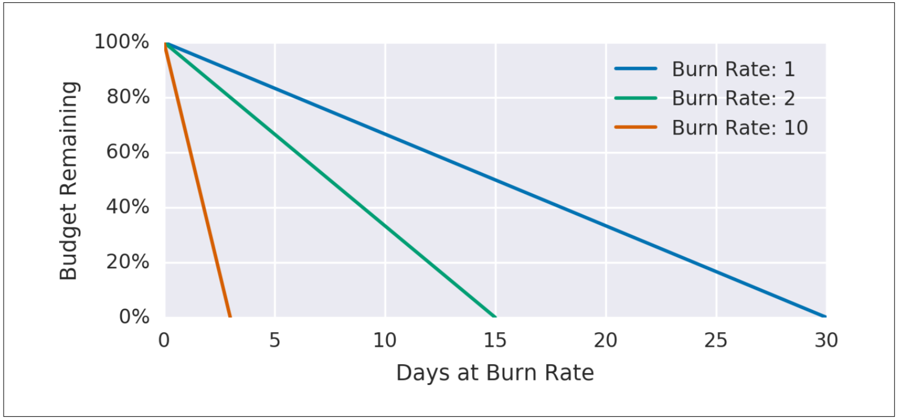
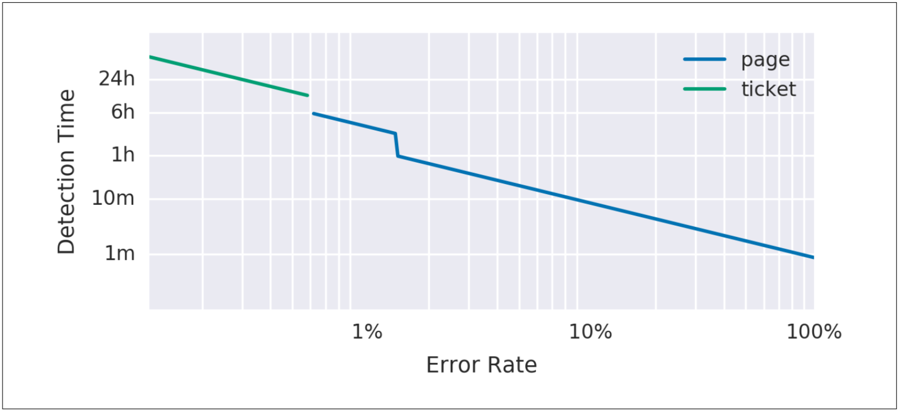
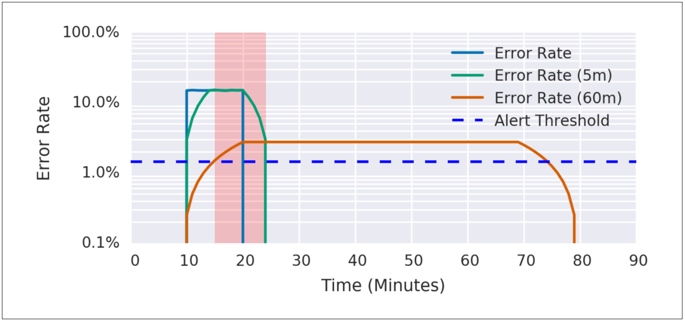

# 重要なイベントのアラート方法

SLOのアラートルール構成は、非常に複雑になる場合があります。
ここでは、精度、リコール、検知時間およびリセット時間の4つのパラメータを同時にうまく制御するオプションに到達するために、忠実度順で重要なイベントに関するアラートを設定する6つの方法を提示しました。
次のアプローチはそれぞれ異なる問題に対処し、いくつかは最終的に複数の問題を同時に解決します。
最初の3つの実現性のない試みは、最後の3つの実現可能なアラート戦略に向けて機能します。6つのアプローチは最も実現可能で最も推奨されるオプションです。
最初の方法は、実装は簡単ですが不十分です。一方、最適な方法は、長期的にも短期的にもSLOを守るための完全なソリューションを提供します。

この説明の目的上、「エラー・バジェット」と「エラー率」はすべてのSLIに適用されます。ただ名前に「エラー」が含まれるものだけではありません。
[20ページの「何を測定するか：SLIの使用」セクション](../../02_implementing-slos/02_02_getting-started/README.md#何を測定するか：SLIの使用)では、イベント合計に対する正常イベントの比率を収集するSLIの使用をお勧めしています。
エラー・バジェットは、許容される異常イベントの数を示し、エラー率は、合計イベントに対する異常イベントの比率です。

## 1:対象のエラー率 ≥ SLO閾値

最も簡単な解決策としては、小さな時間枠(例えば10分)を選択し、その時間枠でのエラー率がSLOを超えた場合にアラートを出すことができます。

例えば、SLOが30日間で99.9%の場合、過去10分間のエラー率が0.1%以上になったときに警告します。

    - alert: HighErrorRate
      expr: job:slo_errors_per_request:ratio_rate10m{job="myjob"} >= 0.001

この10分平均は、記録ルールを使用してPrometheusで計算されます。

    record: job:slo_errors_per_request:ratio_rate10m
    expr:
        sum(rate(slo_errors[10m])) by (job)
        　/
        sum(rate(slo_requests[10m])) by (job)

slo_errorsとslo_requestsをジョブからエクスポートしない場合、メトリックの名前を変更して時系列を作成できます。

    record: slo_errors
    expr: http_errors

最新のエラー率がSLOと等しいときにアラートすることは、システムが次のバジェットの使用を検出したことを意味します。

    アラートウィンドウサイズ/レポート期間

図5-1は、10分のアラートウィンドウと99.9%のSLOを持つサービス例の検知時間とエラー率の関係を示しています。

  
図5-1. アラートウィンドウが10分でSLOが99.9%のサービス例の検知時間

表5-1に、即時エラー率が高すぎる場合のアラートの長所と短所を示します。

表5-1. 即時エラー率が高すぎる場合のアラートの長所と短所

|                                                               長所                                                               |                                                                                                                                   短所                                                                                                                                   |
| -------------------------------------------------------------------------------------------------------------------------------- | ------------------------------------------------------------------------------------------------------------------------------------------------------------------------------------------------------------------------------------------------------------------------ |
| 検知時間が良い：合計停止時間は0.6秒です。このアラートは、SLOを脅かすイベントが発生したときに起動され、正常なリコールを示します。 | 精度が低い：アラートは、SLOを脅かすことのない多くのイベントで発生します。10分間のエラー率が0.1%の場合にアラートが発生し、毎月のエラー予算の0.02%のみが消費されます。極端な例を挙げると、毎日最大144個のアラートを受信し、アラートに対応することなく、SLOを達成できます。 |

## 2:アラート・ウィンドウの増加

前述の例を元に、アラート・ウィンドウのサイズを変更して精度を向上させることができます。
ウィンドウ・サイズを大きくすると、アラートをトリガーする前にバジェット額を増やすことができます。

アラートの頻度を管理しやすくするために、イベントが30日間のエラー・バジェットの5%を消費する場合(36時間以内)にのみ通知することにしました。

    - alert: HighErrorRate
       expr: job:slo_errors_per_request:ratio_rate36h{job="myjob"} > 0.001

検知時間は次のとおりです。

    (1 − SLO / error rate) × alerting window size

表5-2に、より長い時間枠でエラー率が高すぎる場合のアラートの利点と欠点を示します。

表5-2. より大きな時間枠でエラー率が高すぎる場合のアラートの長所と短所

|                                                                                               長所                                                                                                |                                                                                                                 短所                                                                                                                  |
| ------------------------------------------------------------------------------------------------------------------------------------------------------------------------------------------------- | ------------------------------------------------------------------------------------------------------------------------------------------------------------------------------------------------------------------------------------- |
| 完全な停止の場合、検出時間は2分10秒です。前の例よりも精度が向上しています。エラー率が長期間維持されるようにすることで、アラートがエラー・バジェットに対する重大な脅威となる可能性が高くなります。 | 非常に短いリセット時間:100%の停止の場合、アラートは2分後に発生し、その後36時間継続して発生します。長いウィンドウでレートを計算すると、データ・ポイントの数が多いため、メモリーまたはI/O操作の観点でコストが高くなる可能性があります。 |

図5-2に示すように、36時間のエラー率は無視できるレベルまで低下しましたが、36時間の平均エラー率はしきい値を上回ったままです。

  
図5-2. 36時間のエラー率

## 3:アラート期間の増加

ほとんどの監視システムでは、期間パラメータをアラート基準に追加して、値がしきい値をしばらく超えない限りアラートが発生しないようにすることができます。
このパラメータは、より長いウィンドウを追加するための比較的安価な方法として使用できます。

    - alert: HighErrorRate
        expr: job:slo_errors_per_request:ratio_rate1m{job="myjob"} > 0.001
        for: 1h

表5-3に、アラートに期間パラメータを使用する利点と欠点を示します。

表5-3. アラートに期間パラメータを使用することの長所と短所

|                                                                              長所                                                                              |                                                                                                                                                                                            短所                                                                                                                                                                                            |
| -------------------------------------------------------------------------------------------------------------------------------------------------------------- | ------------------------------------------------------------------------------------------------------------------------------------------------------------------------------------------------------------------------------------------------------------------------------------------------------------------------------------------------------------------------------------------ |
| アラートの精度を上げることができます。イベント発火前にエラー率を維持する必要があるということは、アラートが重大なイベントに対応する可能性が高いということです。 | リコール率と検知時間が悪い:インシデントの重大度に応じて期間がスケールしないため、100%の停止が1時間後に警告されます。0.2%の停止が発生した場合も同様の検知時間です。100%の停止では、その時間で30日分のバジェットの140%が消費されます。メトリックが一時的にSLO内のレベルに戻ると、期間タイマーはリセットされます。SLO未達とSLO達成との間で変動するSLIは、アラートが発生しないかも知れません。 |

表5-3に示す理由から、SLOベースのアラート基準の一部として期間を使用することはお勧めしません。【1】

図5-3に、アラートが発生するまでの期間が10分のサービスの5分間の平均エラー率を示します。
エラー・バジェットの35%を消費するにもかかわらず、10分ごとに5分間継続する一連の100%のエラー・スパイクがアラートをトリガーすることはありません。

  
図5-3. 10分ごとに100%のエラースパイクが発生するサービス

各スパイクは30日間のバジェットの約12%を消費しましたが、アラートはトリガーされませんでした。

## 4:バーンレートに関するアラート

以前のソリューションを改善するには、検知時間が短く精度の高いアラートを作成します。
この目的のために、バーンレートを導入することでアラート・バジェットの消費を一定に保ちながらウィンドウのサイズを縮小できます。

バーンレートは、サービスがエラー・バジェットを消費する速度(SLOとの相対値)です。
図5-4は、バーンレートとエラー・バジェットの関係を示しています。

例示しているサービスでは、バーンレートを1に設定しています。つまり、SLOの時間枠の最後にはまったくバジェットが残らない比率でエラー・バジェットを消費していることになります(最初の本の[第4章](http://bit.ly/2szBKsK)を参照)。
30日間のSLOが99.9%の場合、一定の0.1%のエラー率ですべてのエラー・バジェットが使用されます。つまり、バーンレートは1になります。

  
図5-4. バーンレートとエラー・バジェットの関係

表5-4に、バーンレート、対応するエラー率、およびSLOバジェットの消費にかかる時間を示します。

表5-4. バーンレートとバジェット枯渇までの時間

| バーンレート | 99.9% SLOのエラー率 | 枯渇するまでの時間 |
| ------------ | ------------------- | ------------------ |
| 1            | 0.1%                | 30日               |
| 2            | 0.2%                | 15日               |
| 10           | 1%                  | 3日                |
| 1,000        | 100%                | 43分               |

アラート・ウィンドウを1時間に固定し、5%のエラー・バジェット消費は他のユーザーに通知するのに十分であると判断することで、アラートに使用するバーンレートを導出できます。

バーンレートに基づくアラートの場合、アラートが発生するまでの時間は次のとおりです。

    ( ( 1 − SLO ) / error ratio ) × alerting window size × burn rate

このアラートが発生するまでに消費されたエラー・バジェットは次のとおりです。

    ( burn rate × alerting window size ) / period

Five percent of a 30-day error budget spend over one hour requires a burn rate of 36.
The alerting rule now becomes
30日間のエラー・バジェットのうち、1時間以上を費やすものの5%は、36のバーンレートを必要とします。
アラート・ルールは次のようになります。

    - alert: HighErrorRate
      expr: job:slo_errors_per_request:ratio_rate1h{job="myjob"} > 36 * 0.001

表5-5に、バーンレートに基づくアラートの利点と欠点を示します。

表5-5. バーンレートに基づくアラート長所と短所

|                                                                                            長所                                                                                             |                                                                             短所                                                                              |
| ------------------------------------------------------------------------------------------------------------------------------------------------------------------------------------------- | ------------------------------------------------------------------------------------------------------------------------------------------------------------- |
| 精度の良さ:この戦略では、アラートの対象となるエラー・バジェットのかなりの部分を選択します。時間枠が短くなり、計算コストが削減されます。検知時間は良好です。リセット時間の58分は良い方です。 | 低いリコール率:35倍のバーンレートではアラートは表示されませんが、20.5時間で30日間のエラー・バジェットをすべて消費します。リセット時間の58分はまだ長すぎます。 |

## 5: 複数のバーンレートアラート

アラート・ロジックでは、複数のバーンレートと時間枠を使用でき、バーンレートが指定したしきい値を超えた場合にアラートを起動できます。
このやり方では、バーンレートに関するアラートのメリットが維持され、低い(しかし、それでも重要である)エラーレートを見落としてしまうことはありません。

また、通常は通知されないインシデントに対してチケット通知を設定することもお勧めしますが、このようなインシデントは、チェックされていないとエラー・バジェットを使い果たしてしまう可能性があります。たとえば、3日間で10%のバジェットが消費されてしまいます。
このエラー率は重大なイベントを検出しますが、バジェットの消費率はイベントに対処するのに十分な時間を提供するため、誰かを呼び出す必要はありません。

ページャーの開始値として、1時間で2%のバジェット消費、6時間で5%のバジェット消費とすることをお勧めします。また、チケット通知の適切なベースラインとして、3日間で10%のバジェット消費とすることをお勧めします。
適切な数値は、サービスやページロードのベースラインによって異なります。
より混雑したサービスの場合、および週末や祝日のオンコールの責任によっては、6時間以内のチケット通知が必要な場合があります。

表5-6に、消費されるSLOバジェットの割合に対応するバーンレートと時間枠を示します。

表5-6. SLOバジェットの消費率について推奨される時間枠とバーンレート

| SLOバジェット消費 | 時間枠 | バーンレート |  通知  |
| ----------------- | ------ | ------------ | ------ |
| 2%                | 1時間  | 14.4         | Page   |
| 5%                | 6時間  | 6            | Page   |
| 10%               | 3日    | 1            | Ticket |

アラート設定は次のようになります。

    expr: (
            job:slo_errors_per_request:ratio_rate1h{job="myjob"} > (14.4*0.001)
          or
            job:slo_errors_per_request:ratio_rate6h{job="myjob"} > (6*0.001)
          )
    severity: page

    expr: job:slo_errors_per_request:ratio_rate3d{job="myjob"} > 0.001
    severity: ticket

図5-5に、エラー率に応じた検知時間とアラートタイプを示します。

  
図5-5. エラー率、検知時間、およびアラート通知

複数のバーンレートを使用すると、応答時間に基づいて適切な優先順位を与えるようにアラートを調整できます。
問題によって数時間または数日以内にエラー・バジェットが使い果たされる場合は、アクティブな通知を送信することを推奨します。
それ以外の場合は、次の営業日にアラートを通知するチケット・ベースの通知の方が適切です。【2】

表5-7に、複数のバーンレートを使用する利点と欠点を示します。

表5-7. 複数のバーンを使用することの長所と短所

|                                                                                                                                                                                          長所                                                                                                                                                                                          |                                                                                                                                                                                                                                      短所                                                                                                                                                                                                                                      |
| -------------------------------------------------------------------------------------------------------------------------------------------------------------------------------------------------------------------------------------------------------------------------------------------------------------------------------------------------------------------------------------- | ------------------------------------------------------------------------------------------------------------------------------------------------------------------------------------------------------------------------------------------------------------------------------------------------------------------------------------------------------------------------------------------------------------------------------------------------------------------------------ |
| 重要度に応じて監視構成をさまざまな状況に適応できます：エラー率が高い場合は迅速にアラートします。エラー率は低いが持続している場合は最終的にアラートします。あらゆる固定バジェット部分アラートアプローチと同様、精度が高いです。3日間の時間枠のため、リコールが良いです。SLOを守るために誰かがどれだけ迅速に対応しなければならないかに基づいて、最も適切なアラートタイプを選択できます。 | 管理する数、ウィンドウ・サイズ、しきい値の増加とその理由。3日間のウィンドウのため、リセット時間がさらに長くなります。すべての条件がtrueの場合に複数のアラートが発生しないようにするには、アラート抑制を実装する必要があります。例えば、10%のバジェットが5分で費やされたということは、5%のバジェットが6時間で費やされ、2%のバジェットが1時間で費やされたということでもあります。このシナリオでは、監視システムが十分にスマートになっていない場合に3つの通知がトリガーされます。 |

## 6: 複数のウィンドウ、複数のバーンレートアラート

5回のイテレーションの中でマルチバーンレート・アラートを強化して、まだバジェットを使い切っていないときにのみ通知するようにすることで、誤検知の数を減らすことができます。
これを行うには、別のパラメータを追加する必要があります。これは、アラートをトリガーするときにエラー・バジェットがまだ消費されているかどうかをチェックするための短いウィンドウです。

図5-6に示すように、短いウィンドウの長さを長いウィンドウの1/12にするとよいでしょう。
グラフには、両方のアラートしきい値が表示されます。
10分間に15%のエラーが発生した後、短いウィンドウの平均値は即座にアラートのしきい値を超え、長いウィンドウの平均値は5分後にしきい値を超えます。この時点でアラートが起動されます。
短いウィンドウの平均値は、エラーが停止し手から5分後にしきい値を下回ります。この時点でアラートは起動を停止します。
長いウィンドウの平均値は、エラーが停止してから60分後にしきい値を下回ります。

  
図5-6. アラート用の短いウィンドウと長いウィンドウ

例えば、直前の1時間と直前の5分間の両方で書き込み速度が14.4倍を超えた場合に、ページレベルのアラートを送信することができます。
このアラートは、バジェットの2%を消費したときにのみ発生しますが、1時間後ではなく5分後に停止することで、リセット時間を短縮します。

     expr: (
            job:slo_errors_per_request:ratio_rate1h{job="myjob"} > (14.4*0.001)
          and
            job:slo_errors_per_request:ratio_rate5m{job="myjob"} > (14.4*0.001)
           )
          or
           (
            job:slo_errors_per_request:ratio_rate6h{job="myjob"} > (6*0.001)
          and
            job:slo_errors_per_request:ratio_rate30m{job="myjob"} > (6*0.001)
          )
    severity: page
    expr: (
            job:slo_errors_per_request:ratio_rate24h{job="myjob"} > (3*0.001)
          and
            job:slo_errors_per_request:ratio_rate2h{job="myjob"} > (3*0.001)
          )
         or
          (
            job:slo_errors_per_request:ratio_rate3d{job="myjob"} > 0.001
          and
            job:slo_errors_per_request:ratio_rate6h{job="myjob"} > 0.001
          )
    severity: ticket

SLOベースのアラート設定のスタート地点として、表5-8に示すパラメータを推奨します。

Table 5-8. Recommended parameters for a 99.9% SLO alerting configuration

| 重要度 | 長いウィンドウ | 短いウィンドウ | バーンレート | エラー・バジェット消費 |
| ------ | -------------- | -------------- | ------------ | ---------------------- |
| Page   | 1時間          | 5分            | 14.4         | 2%                     |
| Page   | 6時間          | 30分           | 6            | 5%                     |
| Ticket | 3日            | 6時間          | 1            | 10%                    |

複数のバーンレートに基づくアラートは、SLOベースのアラートを実装するための強力な方法であることがわかりました。

表5-9に、複数のバーンレートおよびウィンドウサイズを使用する利点と制約を示します。

表5-9. 複数のバーンレートおよびウィンドウサイズを使用する利点と制約

|                                                                                                           利点                                                                                                            |                                                                                                       制約                                                                                                       |
| ------------------------------------------------------------------------------------------------------------------------------------------------------------------------------------------------------------------------- | ---------------------------------------------------------------------------------------------------------------------------------------------------------------------------------------------------------------- |
| インシデントの重大度と組織の要件に応じてアラートのタイプを制御できる柔軟なアラート・フレームワークです。すべての固定バジェット部分のアラートアプローチと同様、精度が高いです。3日間の時間枠であるためリコールが良いです。 | 指定するパラメータが多いため、アラートルールの管理が困難になる可能性があります。アラート規則の管理の詳細については、[89ページの「アラート規模の拡大」](../05_05_alerting-at-scale/README.md)を参照してください。 |

----------
【1】Duration句は、非常に短い期間の一時的なノイズを除外する場合に便利です。ただし、このセクションに記載されている欠点に注意する必要があります。

【2】Site Reliability Engineeringの[イントロダクション](http://bit.ly/2xCtP3S)で説明したように、ページとチケットは人間に行動を起こさせる唯一の有効な方法です。
